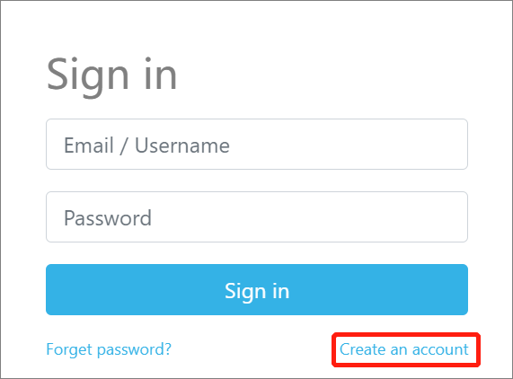
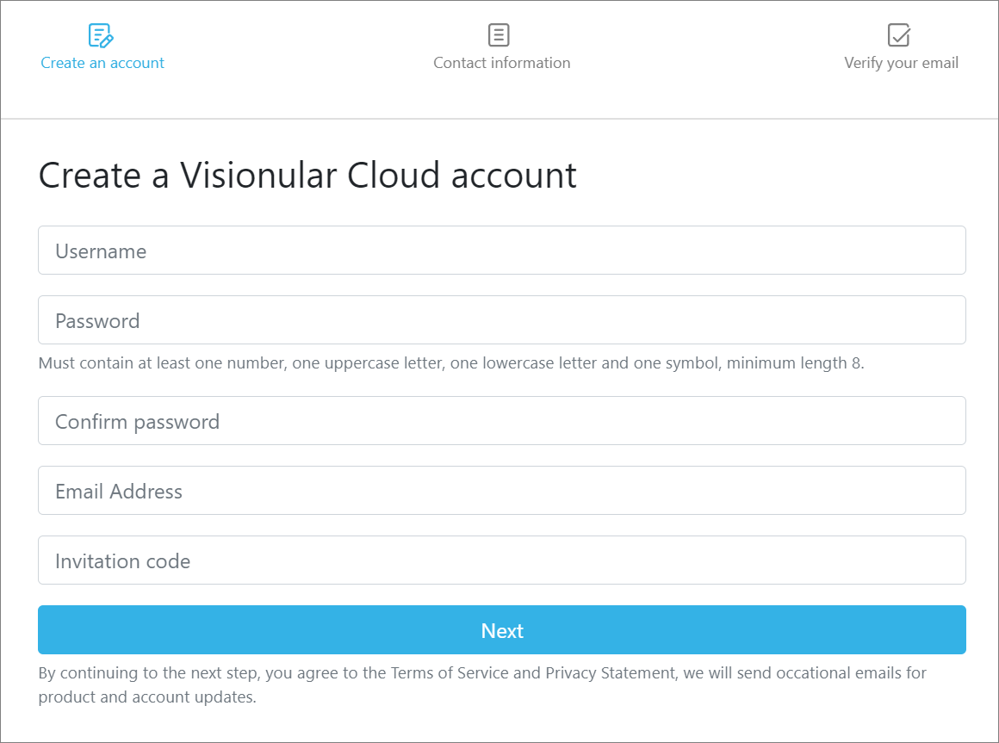
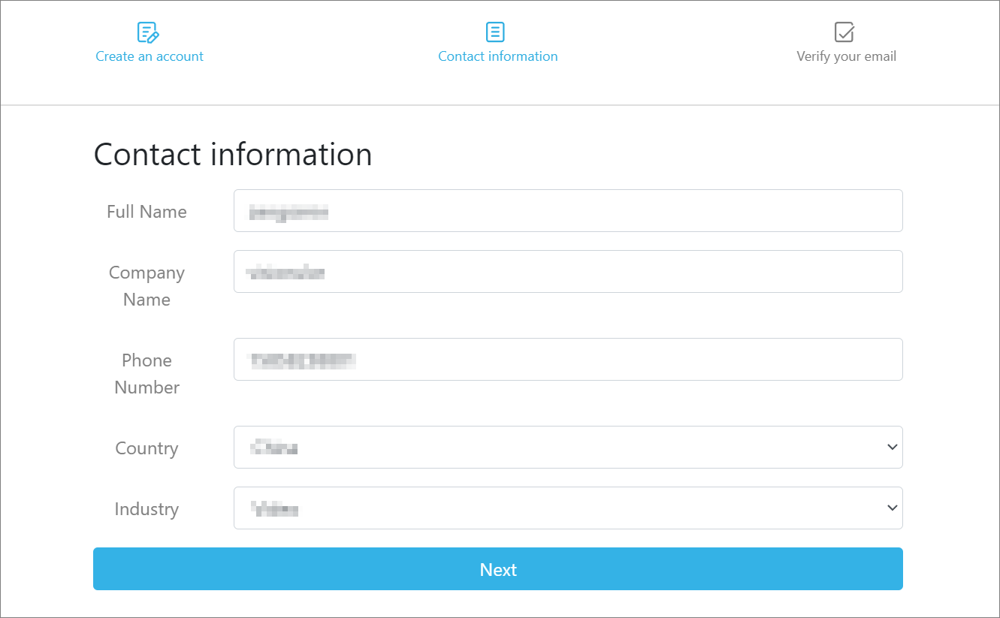
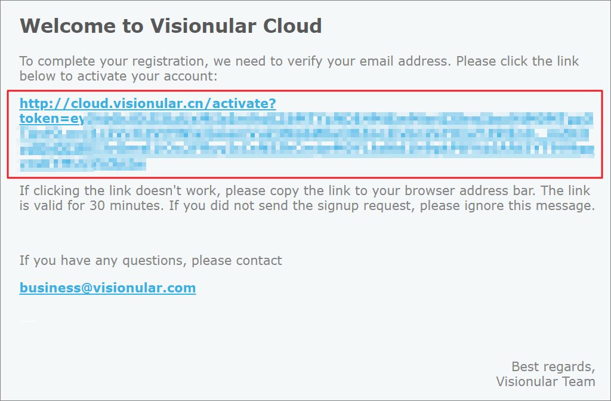

## 快速入门
本文介绍如何快速提交转码任务。

### 注册账户

1. 在[控制台]([Visionular Transcode](http://cloud.visionular.cn/))登录页面，单击**Create an account**。

    

2. 填写注册信息，单击**Next**。

   

   | 参数名词         | 参数解释                                                     |
   | ---------------- | ------------------------------------------------------------ |
   | Username         | 账户名称，用于登录控制台。                                   |
   | Password         | 账户密码，用于登录控制台。                                   |
   | Confirm password | 确认密码。                                                   |
   | Email Address    | 邮箱地址，用于接收服务系统的通知邮件，也可用于登录控制台。   |
   | Invitation code  | 邀请码，请联系交付经理获取。<!--这里要确认一下邀请码从哪里获取--> |
   
3. 填写联系信息，单击**Next**。

   

   | 参数名称     |                      |
   | ------------ | -------------------- |
   | Full Name    | 您的名字。           |
   | Company Name |                      |
   | Phone Number |                      |
   | Country      | 您的公司所属的国家。 |
   | Industry     |                      |

4. 前往您注册时填写的邮箱，根据邮件中的提示单击激活链接。

   单击激活链接后页面自动跳转到登录页面，账号激活成功。

   

### 创建转码任务

